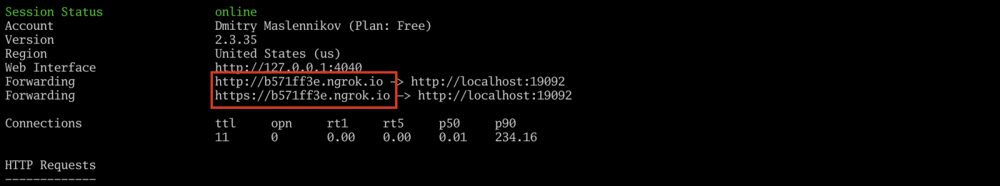
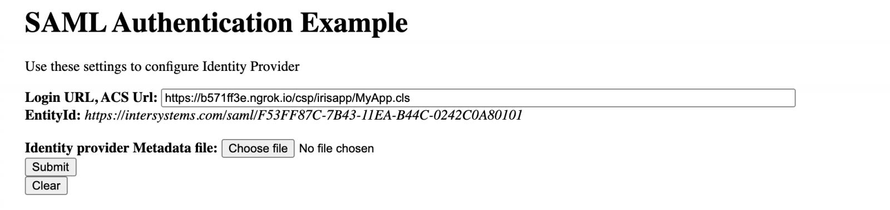

iris-saml-example
====

InterSystems IRIS - SAML Authentication Test

More details about this project, can be read on [Developer Community](https://community.intersystems.com/post/work-saml-iris)

Build and run with docker-compose

```shell
docker-compose up --build -d
```

After a while after build will be completed, and IRIS will start, our test application will be available by URL http://localhost:19092/saml-example/caretdev.examples.saml.MyApp.cls. Google and some other IdP may require that your application should be used over HTTPS. To have access over https to my local application I'm using ngrok project. Let's start secure tunnel to our application.

```shell
ngrok http 19092
```

It should output something like this.



So, our application now available by link http://b571ff3e.ngrok.io/saml-example/caretdev.examples.saml.MyApp.cls, and should show such page.




